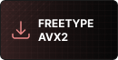

# Amalgam - Competitive Fork

[](/../../stargazers)
[](https://matrix.to/#/#amalgam-comp:matrix.org)
[](/../../actions)
[](/../../commits/)

A competitive-focused fork featuring enhanced information gathering and advantage tracking systems.

<p align="center">
  <a href="https://nightly.link/coffeegrind123/Amalgam-Comp/workflows/msbuild/master/Amalgamx64Release.zip">
    
  </a>
  <br/><br/>
  <a href="https://nightly.link/coffeegrind123/Amalgam-Comp/workflows/msbuild/master/Amalgamx64ReleaseAVX2.zip">
    
  </a>
  <a href="https://nightly.link/coffeegrind123/Amalgam-Comp/workflows/msbuild/master/Amalgamx64ReleaseFreetype.zip">
    
  </a>
  <a href="https://nightly.link/coffeegrind123/Amalgam-Comp/workflows/msbuild/master/Amalgamx64ReleaseFreetypeAVX2.zip">
    
  </a>
</p>

###### AVX2 may be faster than SSE2 though not all CPUs support it (`Steam > Help > System Information > Processor Information > AVX2`). Freetype uses freetype as the text rasterizer and includes some custom fonts, which results in better looking text but larger DLL sizes.
###### If nightly.link is down, you can still download through [github](https://github.com/coffeegrind123/Amalgam-Comp/actions) with an account.

## Added Features

### Competitive Information Systems
All features are fully configurable through the COMP tab menu with individual toggles and customization options.

- **UberTracker** - Comprehensive uber advantage tracking with detailed medic information, weapon types, and advantage calculations
- **HealthBarESP** - Health bars for visible-only players. Includes a medic mode (health bars for teammates when playing medic), health-responsive visibility, and overheal display
- **CritHeals Indicator** - Triangle indicators above players eligible for crit heals (medic-only feature) with uber build rate warnings
- **PlayerTrails** - Colored movement trails for enemy players showing their recent paths with visibility-based display and fade-out effects
- **SentryESP** - Advanced sentry gun ESP with aim line visualization, targeting detection, and special chams for threats. Features corner-style boxes with level indicators (M/1/2/3), real-time aim trajectory lines, and color-coded threat system (green=safe, red=targeting, grey=hidden)
- **StickyESP** - Stickybomb ESP with 2D/3D boxes, visibility-based coloring (green=visible, red=invisible), distance filtering, and chams support
- **FocusFire** - Multi-targeting detection system that highlights enemies being focused by multiple teammates with red corner boxes and chams (2+ attackers within 4.5 seconds)
- **PylonESP** - Vertical pylon indicators above enemy medics behind walls with segmented alpha fade and visibility-based rendering (800+ unit range)
- **AmmoTracker** - Supply respawn ESP with visual countdown timers for health packs and ammo packs. Features filled pie charts (both ground-projected and screen-overlay), configurable timer text with scaling, distance filtering, and color customization for different supply types
- **MarkSpot** - Team coordinate marking system via Matrix integration. Press E while aiming to create visual markers (ground circles + pylons) shared with team members. Features Matrix rate limiting compliance, Steam ID-based color generation, configurable mark duration (5-60s), and full visual customization
- **SplashRadius** - Enhanced splash damage visualization with filled polygons and configurable edge lines. Shows rocket and pipebomb damage radius with dual-color system (fill + edge), adjustable transparency, edge width control, and projectile type filtering
- **EnemyCam** - Picture-in-picture camera window showing enemy player perspectives with multiple targeting modes (closest, healed players, medics, top score) and configurable window position/size
- **OffScreenIndicators** - Directional arrows pointing to off-screen enemies with comprehensive information display. Features configurable arrow size (5-30px), detection range (50-500px from screen center), Steam ID-based color coding, and toggleable information display including player names, classes, health values, and distances. Alpha transparency automatically adjusts based on distance for visual hierarchy
- **Match HUD Enhancement** - Enemy health and class information displayed on match scoreboard/HUD for instant target assessment
- **Safe Bunnyhop** - Advanced movement assistance with configurable success rate (0-100%), safety mechanisms to prevent detection, and perfect jump limiting

### Communication & Coordination

- **Matrix Chat Integration** - Full Matrix client with end-to-end encryption built directly into TF2
  - **Real E2E Encryption** - Complete libolm integration with Megolm group encryption and Olm device-to-device encryption
  - **Multi-User Support** - Device key management, session key sharing, and cross-device message decryption
  - **TF2 Chat Display** - Messages appear directly in TF2 chat with proper color formatting and usernames
  - **Send with !! Prefix** - Type `!!message` in TF2 chat to send to Matrix (blocked from game chat when connected, passes through when not connected)
  - **Optional Timestamps** - Configurable timestamp display in [HH:MM:SS] format
  - **Production Ready** - Thread-safe background sync with Matrix homeservers
  - **Auto-Discovery** - Automatic account creation, room discovery, and encryption initialization

  Configure via CHAT tab: set server, username, password, space, and room. Messages display as: `[Matrix] @username: message`

## Development Setup

### Quick Start
1. **Run the automated setup:**
   ```cmd
   setup.bat
   ```
2. **Open the project:**
   - Open `Amalgam.sln` in Visual Studio 2022
   - Select configuration: `Release` and platform: `x64`
   - Build the solution

For detailed setup instructions, see [DEVELOPMENT_SETUP.md](DEVELOPMENT_SETUP.md).

### Lua Script Porting
For porting Lua scripts to C++, see the comprehensive [LUA_TO_CPP_PORTING_GUIDE.md](LUA_TO_CPP_PORTING_GUIDE.md) with detailed examples, API mappings, and common fixes for successful integration.

## Installation

[Xenos](https://github.com/DarthTon/Xenos/releases) recommended.
