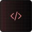

  

  
  
  
  
  
  
  
  
  
   
  
  
  
  

  ###### AVX2 may be faster than SSE2 though not all CPUs support it (`Steam > Help > System Information > Processor Information > AVX2`). Freetype uses freetype as the text rasterizer and includes some custom fonts, which results in better looking text but larger DLL sizes. PDBs are for developer use.
  ###### If nightly.link is down or can't be accessed, you can still download through [GitHub](https://github.com/rei-2/Amalgam/actions) with an account.

#

[VAC bypass](https://github.com/danielkrupinski/VAC-Bypass-Loader) and [Xenos](https://github.com/DarthTon/Xenos/releases) recommended. 
